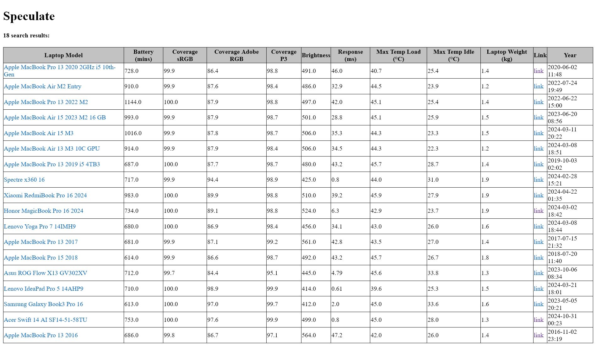

# Speculate 
A web application for comparing laptop specs.

##  Getting Started

- The application requires java 21, make sure you have at least openjdk-21, and maven installed
- The front-end is available in `localhost:8080/`
- The application creates an in-memory database available at `localhost:8080/h2-console`
- You can set the credentials for the in-memory database with the following environment variables: `H2_USERNAME`, `H2_PASSWORD`

## Populating the database

The in-memory database is initialized from the `data.sql` file at `/src/main/resources/data.sql`

If you don't want to use the provided `data.sql` and want to initialize it from scratch:
- delete the `data.sql` file
- run the application with the command-line argument `create`: `./mvnw spring-boot:run -Dspring-boot.run.arguments="create"`
- this will scrape the reviews concurrently.
- you can change the number of concurrent connections to `notebookcheck.net` in the field `foderking.speculate.Seeder.max_concurrent` (if it is too high, you will get a lot of errors)
- once it is done, you can log in to the online console at `localhost:8080/h2-console` and dump the DB with the following command `SCRIPT TO 'data.sql'`
- this download the `data.sql` file to the root directory. 
- you can move that to the resources folder 
- NOTE: you'll need to edit the sql file to remove all those `CREATE` statements, otherwise, hibernate will give errors

## Running

Navigate to the root directory, open the terminal and run
`./mvnw spring-boot:run`

# Buildling 
To compile it to a distributable jar file, run:
`mvn package -DskipTests`
This jar file would be located in something like `target/speculate-0.0.1.jar.original`

## Hot Reloading

To hot reload when the application is already running:
`mvn compile`

## Interface

