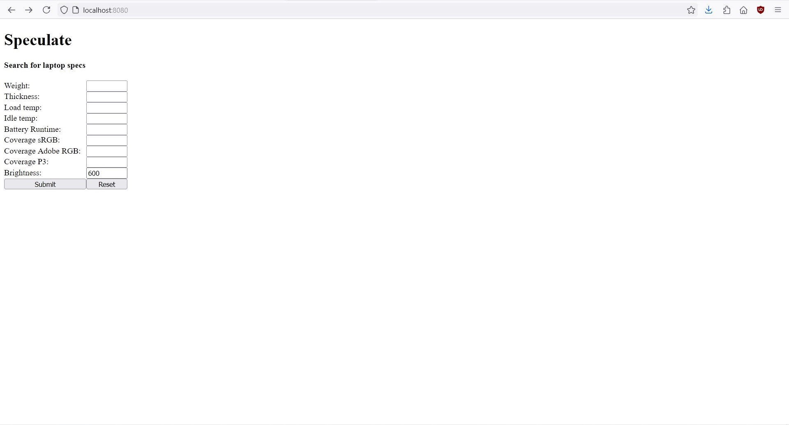
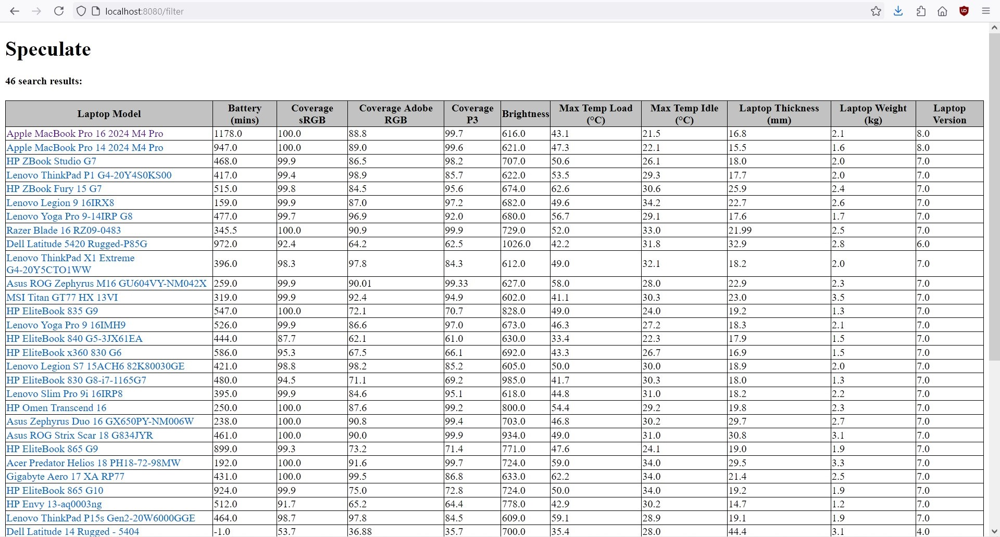

# Speculate 
A web application for comparing laptop specs.

##  Getting Started

- The application requires java 21, make sure you have at least openjdk-21, and maven installed
- The application creates an in-memory database availabe at `/h2-console`
- You can set the credentials with the following environment variables: `H2_USERNAME`, `H2_PASSWORD`

## Running

Navigate to the root directory, open the terminal and run
`./mvnw spring-boot:run`

## Interface

